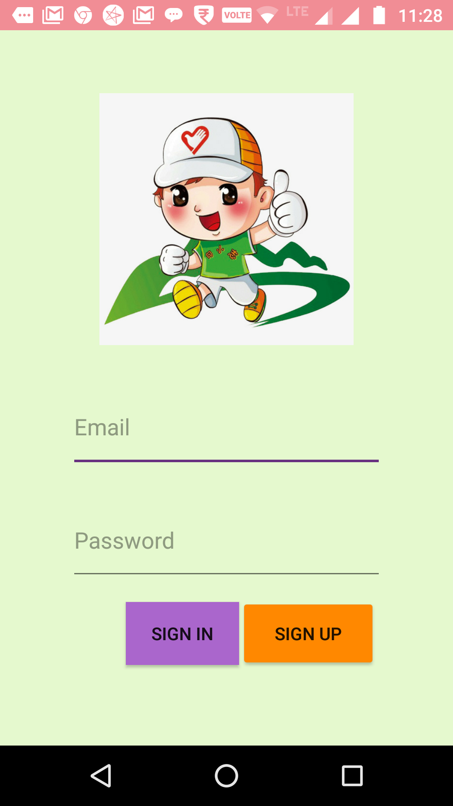
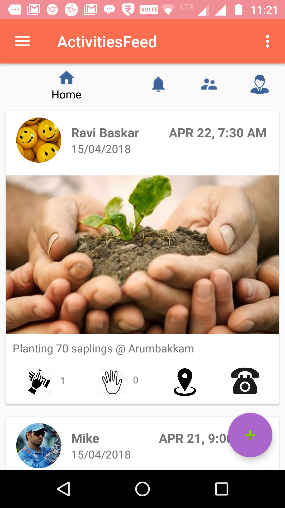
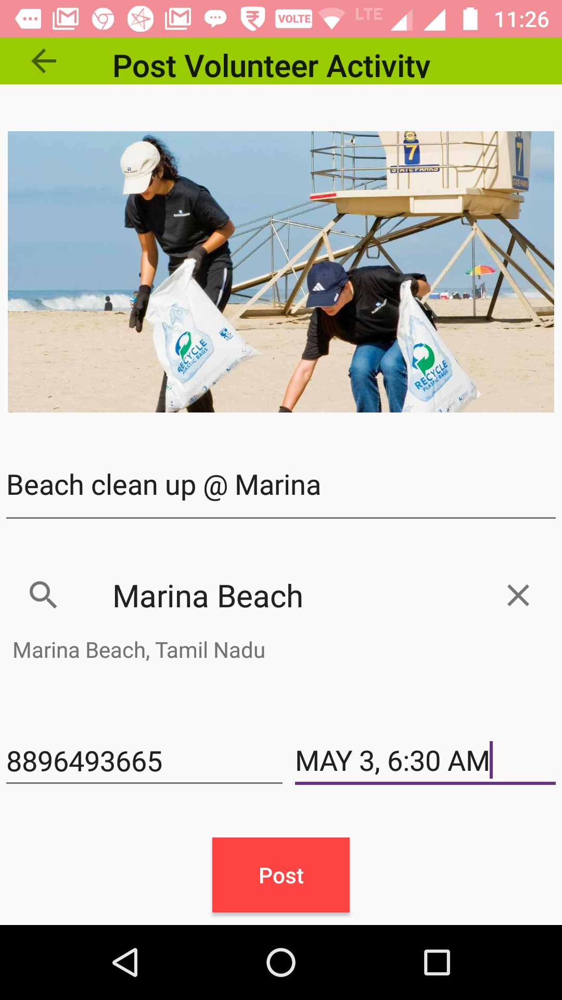
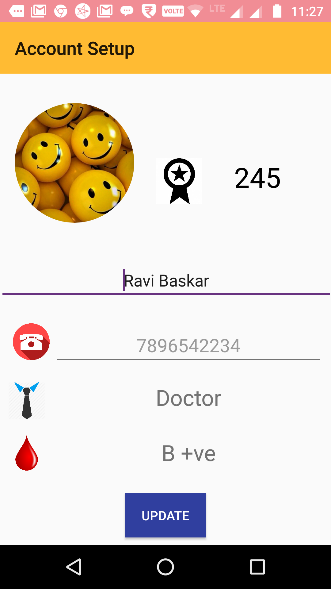

# Messiah
  - An Android  mobile application to connect NGOs, common people and volunteers.
  - Android app is written in Java and uses Firebase as database (Cloud Firestore for users and posts' information, Cloud storage 
    for storing images)
  - User can view/post volunteer activites and call for volunteers.
  - User can appreciate others work by clicking the clap icon.
  - Pagination is implemented in newsfeed.
  - The user who posted the volunteer activity can add points to other users who volunteered, such that each user has an accumulated points 
    for all the volunteer activities.
    
 Below are the screenshots of the app
 
 
 
 
 
 
 
 
